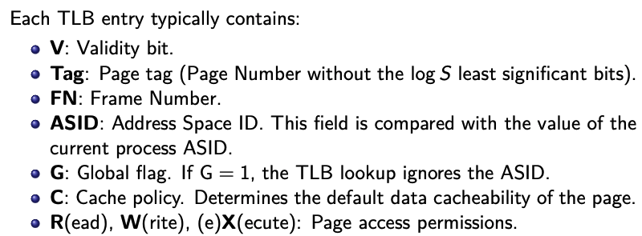

# APS Exam

## 1. Single-cycle CPU

### >> Single-cycle CPU, data and control paths <<

#### Instructions
|Instruction|Syntax|Operation|Type ( [From Type to Imm](#immidiate-for-inst-types) )|wires|
|---|---|---|---|---|
|<b>add</b>|add rd, rs1, rs2|rd = rs1 + rs2;|R||
|<b>sub</b>|sub rd, rs1, rs2|rd = rs1 - rs2;|R||
|<b>and</b>|and rd, rs1, rs2|rd = rs1 & rs2;|R||
|<b>slt</b>|slt rd, rs1, rs2|if (rs1 < rs2) &nbsp;&nbsp;&nbsp;&nbsp; rd=1;  else  &nbsp;&nbsp;&nbsp;&nbsp; rd=0;|R||
|<b>addi</b>|addi rd, rs1, imm11:0|rd = rs1 + imm11:0;|I||
|<b>lw</b>|lw rd,imm11:0(rs1)|rd = Memory[rs1 + imm11:0]|I||
|<b>sw</b>|sw rs2,imm11:0(rs1)|Memory[rs1 + imm11:0] = rs2;|I||
|<b>slli</b>|slli rd, rs1, imm4:0| rd = rs1 << imm4:0|I||
|<b>srai</b> (Arithmetic)|srai rd, rs1, imm4:0| rd = (signed) rs1 >> imm4:0|I||
|<b>srli</b> (Logic)|srli rd, rs1, imm4:0| rd = (unsigned) rs1 >> imm4:0|I||
|<b>bne</b>|bne rs1, rs2, imm12:1|if (rs1 != rs2) &nbsp;&nbsp;&nbsp;&nbsp; PC = PC + imm12:1;  else  &nbsp;&nbsp;&nbsp;&nbsp; PC = PC + 4;|B||
|<b>beq</b>|bne rs1, rs2, imm12:1|if (rs1 == rs2) &nbsp;&nbsp;&nbsp;&nbsp; PC = PC + imm12:1;  else  &nbsp;&nbsp;&nbsp;&nbsp; PC = PC + 4;|B||
|<b>jal</b> (Jump and Link)|jal rd, imm20:1| rd=PC+4; PC=PC+imm20:1;|J||
|<b>jalr</b> (Jump Register)|jalr rd, rs1, imm11:0|rd=PC+4; PC = rs1 + imm11:0;|I||
|<b>lui</b>|lui rd, imm31:12|rd = {imm31:12,'0000 0000 0000'};|U||

### >> Memory-mapped I/O <<

#### Idea

Implement something, through which we will communicate with I/O peripheral devices (keyboards, monitores, printers). We can use part of main memory, just let's reserve some part of it for this devices. This is called <b>Memory mapped I/O</b>.

We will extend part after Date Memory Bus. Let's add Addtess Decoder. If address coresponds to I/O device -- it will activate I/O device (not main memory) and read from/wrtie to it.
CPU checks, whether device is ready to recieve a data by periodic checking of its flag. This is called <b>polling</b> or <b>busy waiting</b>.

There is also another approache, to create CPU I/O communication -- <b>Port-mapped I/O</b>. Create a separated I/O address space, which accessable by special I/O instructions (in and out for x86).

[Example](#example-for-memory-mapped)

### >> Pipelinging <<

Let's decompose instruction execution into 5 stages : <b> Instruction Fetch, Instruction Decode, Execute, Memory access and Write Back</b>. The decomposition of an instr cycle into more stages is called <b>instruction pipelining</b> (<b>IP</b>). We will add <b>interstage registers</b> into several stages. <b>Data and control signals</b> of the IP are <b>transferred to the next stage</b> from pr at the rising edge. 

||Picture|
|---|---|
|Stages||
|The Current Microarchitecture.  Pass data to RegWriteM and RegWriteW, if data forwarding solution for data hazard applied  From ForwardAE,ForwardBE we take data, if we use data forwarding to solve data hazard  Stall F,Stall D -- activated, if stallying solution for data hazard applied  FlushD and FlushB - flush instructions, if we taking brancing| [HMU inputs and outputs](#hmu-inputs-and-outputs)|

#### Data and control hazards

Since multiple instructions are processed simultaneously, requirements for <b>shared recources</b> can result in conflicts(<b>hazards</b>).

> <b>Example</b>: squential instructions. In first one we store result (`add x1,x2,x3`) and in the next -- work with it(`sub x5,x1,x4`). The result of the first instruction is going to be ready only in the last stage(write back), while second instruction already read wrong(old) data from register x1 on the 2nd stage and used it in the exec stage.

<b>Hazard types:</b>
<ol>
<li><b>Data</b> - caused by data dependencies.</li>

|Example|Explanation and Solution|
|---|---|
|`add x1,x2,x3` `add x4,x1,x5`|&nbsp;&nbsp;&nbsp;&nbsp;The result of the 1st instr going to be written into x1 register only in the last  stage(write back), while the second intruction going to reach 4th stage and  had read wrong data on the 2nd and procced it in the 3rd stage. &nbsp;&nbsp;&nbsp;&nbsp;We are going to resolve it by <b>forwarding</b>. The data from 1st instruction is already  available in the 4th stage (MEM) and therefore it can be taken from those data paths  (and stored into regWriteM)before writing it into the destination register.|
|`lw x8, 40(x0)` `add x4,x8,x1`|*The problem the same, as higher.* &nbsp;&nbsp;&nbsp;&nbsp; The result of lw is not going to be ready in the 4th stage, cause result of reading  from memory going to appear only in the last stage. So, simple there is <b>no way</b>  how to get result for the 2nd inst, while it reached 3rd stage. We will resolve it  by <b>stallying</b>(= frozen) pipeline(activate Stall D). Pr instructions not going forward,  until we will finish current instruction.|
<li><b>Control</b> - caused by instructions that change PC.</li>

|Example|Explanation and Solution|
|---|---|
|`beq x1,x2, loop` `and x5,x8,x9` `or x6,x4,x8` `loop:` `add x2,x3,x4`|&nbsp;&nbsp;&nbsp;&nbsp;The result of beq will be known only on the 3rd stage. In the mean time,  IP <b>has started</b> precessing of 2 futher instructions. If we are not taking branch,  everything alright. Otherwise, instructions must be canceled and this translates  into insertion of <b>2 bubbles</b>.(Flush the 1st and the 2nd stages by Flush D and Flush E).  With instructions `jal` and `jalr` will be the same. Their result will be computed  on the execution stage and only after that forwarded to fetch stage.(Flush D, Flush E  and store destitaion PC into BranchOutcomeE).|
<li><b>Structural</b> - the number of simultaneous requirements for a given resource exceeds the number of its instances.</li>

</ol>

[Full example](#pipelining-example)

### >> [Interrupt subsystem and security levels](https://courses.fit.cvut.cz/BIE-APS/media/lectures/BIE-APS-Lecture05-Interrupt.pdf) <<

## 2. Cache Memory

### >> Cache memory <<

#### Motivation

&nbsp;&nbsp;&nbsp;&nbsp;Two types of RAM(Random Access Memory): <b>SRAM</b>(Static RAM) and <b>DRAM</b>(Dynamic RAM) ([\*](#sram-and-dram)). Comparing them, SRAM is much faster than DRAM and consumpt lower power. But, it is <b>more expensive</b> ([\*](#sram-vs-dram)). Typically, Main Memory implemented as DRAM, cause of lower cost and therefore possibilities
to realize greater capacities up to hundreds of GB. And, gap between the CPU performance and MM access latency is widening for last 50 years, and difference between them is something like in 106 times ([\*](#cpu-vs-mm))!!!

#### Idea

&nbsp;&nbsp;&nbsp;&nbsp;The solution of the widening gap between CPU performance and DRAM memory access latency has traditionally been the <b>hierarchical memory architecture</b>. Memory access latency in this hierarchy decreases towards CPU, since the memory size decreases. This allows to hide the latency of a slow MM: CPU primarily works with smaller, but faster cache memories (CM). The key condition here is that programs maximally exploit principles of Memory Locality: the <b>temporal</b>(Items that have been <b>accessed recently</b> will be accessed soon again) and <b>spatial</b>(Items that are <b>stored close</b> to those currently accessed will be accessed soon) locality principle.

***Cache memory*** -- is a memory invisible for a program that the runtime HW system uses automatically to store repeatedly accessed data or instructions <b>closer to CPU<b>. 
> The task of CM is to speedup access to frequently used MM data/instructions by keeping copies of MM data/instructions.
>
> CM is integrated <b>inside</b> the CPU. 
>
> It is realized as SRAM due to performance reasons.

#### Relation between Main Memory (MM) and Cache Memory (CM)

&nbsp;&nbsp;&nbsp;&nbsp;The address range of CPU's is huge. At the same time, the size of fast CMs not so big. So, data between MM and CM transferred in blocks (BlockIndex = Address div BlockSize (BS)). The MM can be viewed as a <b>linear array of equally-sized indexed blocks</b>. While, CM numbers of block is smaller, than MM blocks, CM at a given time able to store only a <b>very limited</b> number of MM blocks.

Basic Structure           |  Scheme
:-------------------------:|:-------------------------:
 |  

> This type of memory called <b>direct-mapped</b>

#### Address Collision Problem in Direct-Mapped CMs

&nbsp;&nbsp;&nbsp;&nbsp;If different addresses going to have same set -- they going to replace each other. And if we asking this block of memory in row, it even <b>could slow-down computation!</b>

Two solutions
<ol>
<li>Enlargement of the CM -- it can only reduce the probability, but not a universal solution.</li>
<li><b>Different internal organization</b> -- let's create N instances of CM (<b>ways</b>). We will call it <b>N-way set-associative CM</b>.</li>
</ol>

Basic Structure (2-way)        |  Scheme (4-way)
:-------------------------:|:-------------------------:
 |  

> Other extreme : <b>Fully associative CMs</b> -- number of CM block equals the number of CM ways.

#### Cache block replacement policy. Pseudo-Least Recently Used (LRU).

&nbsp;&nbsp;&nbsp;&nbsp;Consider a 4-way set-associative CM. It will hold 3-bit (N-way - 1) state vector.
<ol>
<li><b>Miss or hit?</b>: <b>Hit</b> - use that block; <b>Miss</b> - next.</li>
<li><b>Are all 4 blocks valid?</b>: <b>No</b> - Allocate an invalid block and change the state(based on table.); <b>Yes</b> - next; 
<li>00X - first block, 01X - second, 1X0 - third, 1X1 - forth. Replace this block and change state.<b> 00X -> 11X; 01X -> 10X; 1X0 -> 0X1; 1X1 -> 0X0.</li>
</ol>

#### CM from programmer's prespective

&nbsp;&nbsp;&nbsp;&nbsp;Application of temporal and spacial locality can provide significant execution speedups, but still: even the best compiler just compiles a code written by a programmer. So, he has the greatest responsibility for efficiency. <b>Instruction CM</b> efficiency will depends on structure and control flow of executed algorithms. <b>Data CM</b> - suitable data layout is data, processed sequentially are stored sequentially in the MM.

### >> Virtual memory <<

#### Motivation
<ol>
<li><b>The lack of MM</b> - the size of MM is not big enough for all processes.</li>
<li><b>Fragmentation</b> - after termination of precesses, free areas fragmented and we cannot allocat new fragment, even the total free capacity is sufficient.</li>
<li><b>Dynamic allocation</b> - problem to allocate additional memory (it already maybe occupied). We cannot change address space.</li>
<li><b>Security</b> - we want to isolate MM address space, os processes can read and write only their allocated MM.</li>
</ol>

#### Solution

&nbsp;&nbsp;&nbsp;&nbsp;<b>MM virtualization by paging</b>. Each process has got <b> virtual address space (VAS)</b>. For each process it is partitioned into equally-sized pages. <b>Physical address space (PAS)</b> of the MM is partitioned into equally-sized frames. <b>Page size = frame size</b>. Running pracesses map and store their currently used pages of their VAS into the MM frames. In case no free MM is available, pages are temporarily moved to a secondary memory.

> Mapping between MM and secondary memory is controlled by OS.

#### Mapping of VAS into the PAS

&nbsp;&nbsp;&nbsp;&nbsp;After VAS is created, the process is already assigned specific virtual addressses, that it can use, but still <b>no specific physical address</b> corresponds. A given page will be assigned a frame <b>only the first time</b> it is used. This is called <b>demand paging</b> or <b>lazy loading</b>.
> <b>The role of MM virtualization in memory hierarchy<b>.
> - It allows to share MM by several concurrent processes.
> - It provides mutual protection of process address spaces.
> - A running precess uses virtual addresses.

#### Mapping of VAS into the PAS = Virtual address to Physical address (VA-to-PA) translation

&nbsp;&nbsp;&nbsp;&nbsp;If the VA is valid, then it must be translated into a PA. There are two main implementation: <b>Standart Page Tables (PT)</b> (Each process running within the OS has its <b>own Page Table tree</b>) or <b>Inverted Page Tables (IPT)</b> (all precesses share a single IPT). Unit, which translate address is called <b>Memory Management Unit (MMU)</b>.

> Page fault will be covered little bit later

#### Mapping with Page Tables

&nbsp;&nbsp;&nbsp;&nbsp;Each process has got physical address of Top level Page Table <b>pgd</b>. It's devide virtual address into page numbers (equal to number of levels of tables) and offset. After, it runs <b>page walk</b>. Result of a page walk (in the last level of page tables) is going to be frame number -- Physical address (which with offset going to give us a Physical address).

Sheme of whole Page Table structure|  One page table inside (in case 4th level page talbes, like on left, size of one page table will be 29)
:-------------------------:|:-------------------------:
| 

#### HW support of VA-to-PA

&nbsp;&nbsp;&nbsp;&nbsp;Page wak is always a high latency task. To eliminate a page walk during each VA-to-PA, each MMU uses a special HW <b>Translation lookaside buffer (TLB)</b>. TLB is a <b>cache for page tables</b>: it stores translations of the most recently used VA-to-PA requests.

set-associative TLB | Description
:-------------------------:|:-------------------------:
| 

#### Scheme with MMU

#### Page fault

&nbsp;&nbsp;&nbsp;&nbsp;<b>Page fault</b> - is a situation, when CPU generates an exception, cause MMU is unable to translate VA. There are 2 types:
- <b>Invalid Page Fault</b> - situation, where the required address is <b>not part of the VAS</b>. Usually cause seg fault.
- <b>Valid Page Fault</b> - MMU cannot translate the VA cause:
	- The translation is not found in the MMU and the MMU cannot perform a page walk. OS performs a page walk and writes the translation to the MMU.
	- Translation does not exist. OS must ensure that page from disk to MM.

[Example](#va-to-pa-translation)

### Memory coherence

#### Multiprecessor system

&nbsp;&nbsp;&nbsp;&nbsp;There are two main types: <b>Shared Memory System (SMS)</b>(MM is shared) and Distributed Memory System (each computing node has its private part of the MM). We are going to talk about SMS. It can have:
- <b>Physically shared MM</b> - the MM is centralized for all nodes. This is going to create <b>Uniform Memory Access (UMA)</b>. Also, there can be <b>Symmetric multiprocessor (SMP)</b> - multiprocessor, that uses identical processors and single physically shared MM.
- <b>Physically distributed MM</b> - each node has its own local MM, but _can_ access the local MMs of ther nodes(VAS logically shared). It is creating <b>Non-Uniform Memory Access (NUMA)</b>.

#### Memory coherence problem

### Atomic instructions

## 3. Superpipelinging CPU

### Dynamic superscalar microarchitecture

### Load/Store instruction processing in superscalar processors

### Branch prediction in superscalar microarchitectures

                        

# Extra materials

## Immidiate for Inst Types

## Example for Memory Mapped

## HMU(Hazard Menegment Unit) inputs and outputs

## Pipelining example

|Picture|Explanation|
|---|---|
|||
|||
|||
|||
|||
|||
|||
|||
|||
|||

## SRAM and DRAM

## SRAM vs DRAM

## CPU vs MM

## VA-to-PA translation
1|2|3|4
:----:|:----:|:----:|:----:
|||